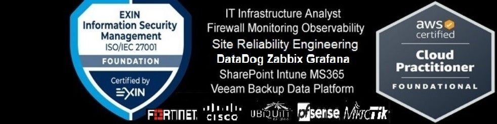

IT Infrastructure Analyst | SRE | DevOps | AI Coder Architect | Cloud & Cybersecurity

## 📁 Portfólio Técnico 👇
**🌐 Infraestrutura:** [webtecinfotec.com.br](https://www.webtecinfotec.com.br)  
**🚀 Projetos SaaS com Observabilidade em DataDog:** [checkenf.netlify.app](https://checkenf.netlify.app) | [construfacil.app.br](https://construfacil.app.br)  
**📱 Apps Android:** [Google Play Store](https://play.google.com/store/apps/developer?id=WebTec+InfoTec)

Profissional de TI com experiência em infraestrutura e suporte, evoluindo para SRE, DevOps e Arquitetura de código com IA.
Minha trajetória combina sólidos conhecimentos em infraestruturas on-premise e práticas em tecnologias modernas de nuvem, automação e desenvolvimento assistido por IA.
Autodidata, analítico e com visão de negócios, buscando integrar segurança, eficiência operacional e inovação tecnológica.

**Certificações:** EXIN® ISO/IEC 27001 e AWS Cloud Practitioner.

---
## 🛠️ Principais Competências 👇
- **Infraestrutura & Cloud** : Administração de sistemas, redes e serviços em nuvem.
- **Segurança & Monitoramento** : Implementação de Active Directory e GPO's, políticas de segurança, firewalls e ferramentas de observabilidade.
- **DevOps & Automação** : CI/CD, containers, orquestração e automação de processos.
- **Arquitetura de Código com IA** : Desenvolvimento web/mobile (Kotlin, JavaScript e Apache Cordova).
- **Gestão de Projetos** : Implantação de ERPs, sistemas hospitalares e comerciais e aplicativos SaaS.

---
## 🎯 Atualmente Focando Em 👇
- Desenvolvimento de aplicações SaaS com práticas de SRE e Observabilidade em DataDog e ferramentas integradas.
- Publicação de aplicativos Android na Google Play Store.
- Transição para posições estratégicas que integrem Infraestrutura, DevOps, Segurança, Desenvolvimento e Automações com IA.
  
---
## 📫 Contato
- **LinkedIn:** [Everson TI](https://www.linkedin.com/in/eversonti/)
- **Email:** titecnologiasorocaba@gmail.com
  
---

### ⚡ **Disponível para oportunidades que unam Infraestrutura, DevOps, Segurança e Inovação com IA**

#SRE #DevOps #DevOpsEngineer #SiteReliabilityEngineering #CloudComputing #AIEngineering #CodeArchitecture #CloudArchitecture #InfrastructureAsCode #Kotlin #JavaScript #ApacheCordova #AWS #AmazonWebServices #DataDog #Zabbix #UpTimeKuma #Wazuh #Observability #Automation #CyberSecurity #InfoSec #ISO27001 #SaaS #MobileDevelopment #AndroidDev #GooglePlay #ERP #HealthTech #HospitalSystems #TechInnovation #SelfTaught #LifelongLearner #Analytical #BusinessOriented #TecnologiaDaInformação #TI #DevOpsBrasil #Linux #Windows #CloudBrasil #Desenvolvedor #ArquitetoDeSoftware #SegurancaDaInformacao #InfraestruturaDeTI #Programador #InovacaoTecnologica

