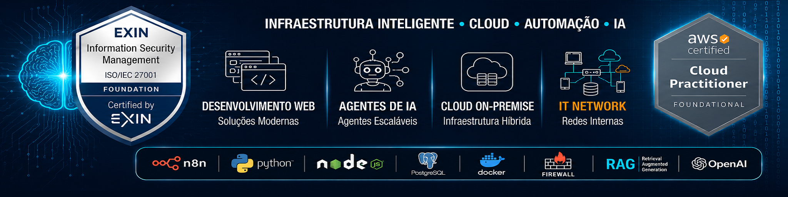

  

  <h1>👋 Olá, eu sou Everson Silva</h1>

  

    <strong>AI-Native Product Engineer | SaaS & Automation Architecture | Cloud | DevOps, SRE & Infrastructure</strong>
  

  

    
    
  

---

### 🚀 Sobre Mim

Experiência em **infraestrutura crítica on-premise, sistemas distribuídos e cloud**, com foco total em **produto e operações**. Atualmente, meu trabalho é a convergência entre a robustez do SRE e a inovação da IA.

Especialista no desenvolvimento de **SaaS e automações com integração de IA (LLMs)**, cobrindo desde a avaliação de performance e tuning de prompts até estratégias complexas de fallback. Aplico práticas de SRE para garantir que sistemas de IA sejam não apenas inteligentes, mas **confiáveis, eficientes e escaláveis**.

---

### 🛠️ Tech Stack & Expertise

  
  
  
  
  
   
  
  
  
  

---

### 🏅 Certificações em Destaque
*   **AWS Certified Cloud Practitioner**
*   **EXIN Information Security Management** (ISO/IEC 27001)

---

### 📊 GitHub Stats

  
  

---

  Construindo o futuro da infraestrutura com IA. Vamos nos conectar?

