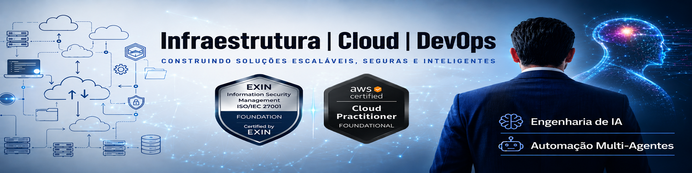
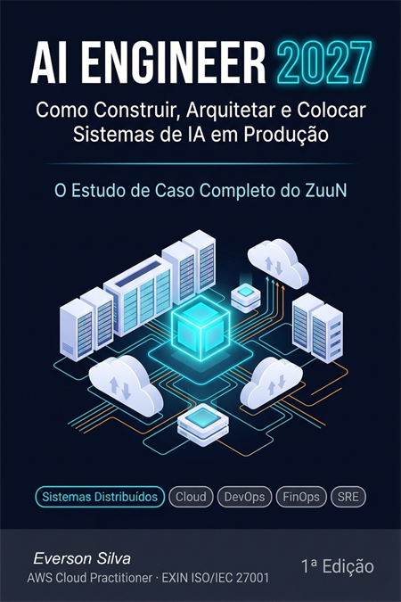

  

  

    <strong>AI Engineer & Solutions Architect | SaaS & Automation Architecture | Cloud | DevOps & SRE</strong>
  

  

    
    
    
  

---

### 🚀 Sobre Mim

AI Engineer & Solutions Architect focado em engenharia de produto, arquitetura de sistemas inteligentes e geração de valor por meio da convergência entre negócio, tecnologia e experiência do usuário.
Autor do livro **"AI ENGINEER 2027"**, atuo na interseção estratégica entre **Sistemas Confiáveis (SRE / Infraestrutura Crítica)**, **Cloud Architecture** e **Inteligência Artificial Aplicada**. Especialista na concepção de plataformas SaaS escaláveis, orquestração de **agentes autônomos multi-provedor com fallback resiliente**, pipelines RAG e automações corporativas de alta performance com governança estrita (ISO/IEC 27001).

---

### 📚 Publicação Oficial: Livro AI ENGINEER 2027

  <table>
    <tr>
      <td width="32%" align="center">
        
      </td>
      <td width="68%" valign="middle">
        <h3>AI ENGINEER 2027 — Da Concepção à Produção Real</h3>
        
Um relato técnico direto sobre a transformação de modelos teóricos de IA em arquiteturas reais de produção. Focado em engenharia de software aplicada, resiliência de sistemas distribuídos e viabilidade econômica.

        

          🔹 <strong>FinOps de Custo Nulo em Repouso:</strong> Edge computing e serverless orientados a evento. 
          🔹 <strong>Resiliência Multi-LLM:</strong> Agentes autônomos com fallback em cascata e validação estrita. 
          🔹 <strong>Geofencing de Baixa Latência:</strong> Processamento em tempo real sob restrições severas. 
          🔹 <strong>Casos Reais de Produção:</strong> Arquitetura, telemetria e lições práticas do ecossistema ZuuN.
        

        

          
          
        

      </td>
    </tr>
  </table>

---

### 🛠️ Tech Stack & Expertise

  
  
  
  
  
  
   
  
  
  
  
  

---

### 🛡️ Certificações em Destaque
* ☁️ **AWS Certified Cloud Practitioner** (Foundational)
* 🔒 **EXIN Information Security Management Foundation** (ISO/IEC 27001)

---

  
  

---

  Construindo o futuro da infraestrutura com IA e engenharia de produto. Vamos nos conectar?

